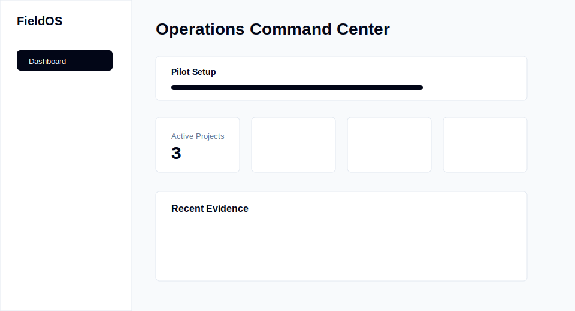
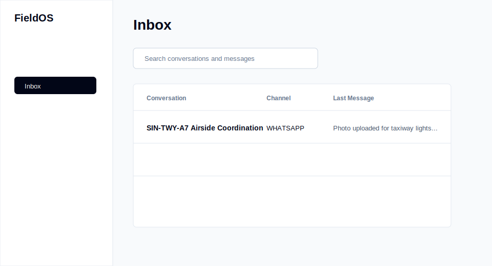

# Quick Start

| Field        | Value                                                 |
| ------------ | ----------------------------------------------------- |
| Purpose      | Help a pilot user start FieldOS in under ten minutes. |
| Owner        | Product Engineering                                   |
| Status       | Active                                                |
| Last Updated | 2026-07-08                                            |

## Table of Contents

- [Start](#start)
- [Demo Workspace](#demo-workspace)
- [Screenshots](#screenshots)
- [Production Checks](#production-checks)

## Start

1. Open the dashboard.
2. Sign up or log in.
3. Click `Launch demo workspace`.
4. Open the Dashboard, Inbox, Search, and Project Intelligence pages from the navigation.
5. Use `Reset demo workspace` before another walkthrough.

## Demo Workspace

The demo workspace creates aviation project data, WhatsApp-style conversations, messages, evidence records, voice transcripts, PDF metadata, timeline events, generated reports, and open Action Items. It is marked as demo data and can be reset without touching production organizations.

## Screenshots

## Production Checks

Confirm API health, worker heartbeat, R2 storage, Railway deployment status, and dashboard login before each pilot session.
