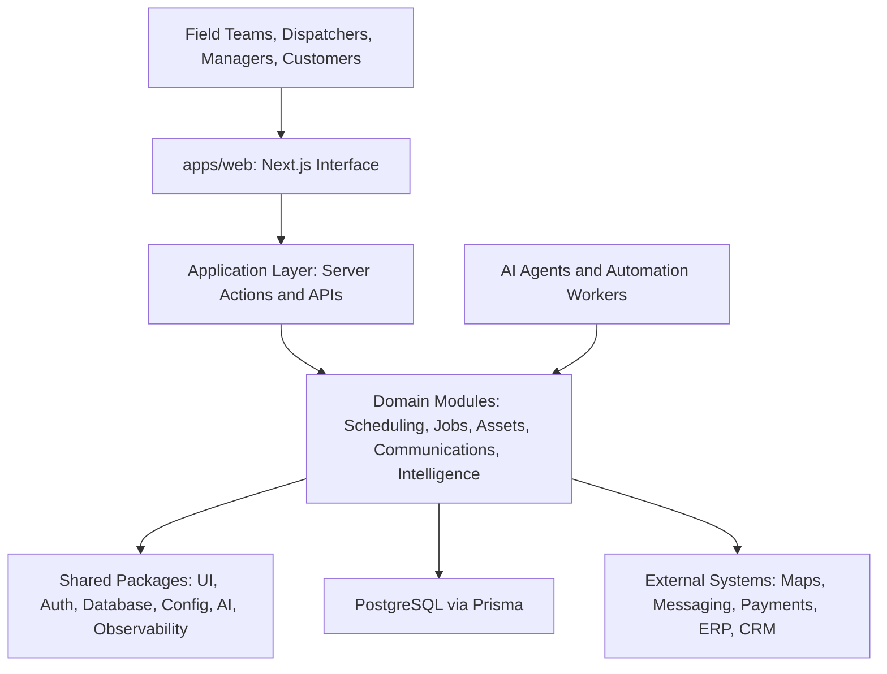

# FieldOS

| Field        | Value                                                             |
| ------------ | ----------------------------------------------------------------- |
| Purpose      | Introduce the FieldOS engineering foundation and operating model. |
| Owner        | Founding Engineering                                              |
| Status       | Draft                                                             |
| Last Updated | 2026-06-30                                                        |

## Table of Contents

- [Vision](#vision)
- [Product Summary](#product-summary)
- [High-Level Architecture Diagram](#high-level-architecture-diagram)
- [Repository Structure](#repository-structure)
- [Development Philosophy](#development-philosophy)
- [Tech Stack](#tech-stack)
- [Current Roadmap](#current-roadmap)
- [Contributing Guidelines](#contributing-guidelines)
- [License](#license)

## Vision

FieldOS is the AI Operating System for Field Operations: a command layer for work that happens outside the office, where crews, dispatchers, managers, customers, assets, schedules, documents, and compliance obligations all need one shared source of truth.

The long-term vision is to make field organizations faster, safer, and more adaptive by pairing durable operational systems with AI agents that can understand context, coordinate work, and reduce administrative drag.

## Product Summary

FieldOS will begin as a modular web platform for field operations teams. The product will organize core workflows such as job intake, scheduling, dispatch, field execution, documentation, customer communication, reporting, and operational intelligence.

Initial product work will focus on building a reliable foundation before vertical-specific workflows are added.

## High-Level Architecture Diagram



## Repository Structure

```text
apps/             Product applications such as web, mobile, workers, and admin tools.
packages/         Shared packages with explicit ownership and public interfaces.
docs/             Product, architecture, database, UX, roadmap, and engineering docs.
tests/            Cross-package test harnesses, fixtures, and integration suites.
scripts/          Development, CI, release, and operational scripts.
infrastructure/   Infrastructure as code and deployment configuration.
.github/          GitHub governance, templates, ownership, and workflows.
```

## Development Philosophy

- Build the smallest durable system that can support the next stage of learning.
- Prefer clear domain boundaries over premature service extraction.
- Keep platform decisions reversible where possible and documented where not.
- Treat operational reliability, security, and observability as product features.
- Make AI behavior inspectable, constrained, and accountable to human operators.

## Tech Stack

- Runtime: Node.js
- Package manager: pnpm
- Monorepo orchestration: Turborepo
- Language: TypeScript
- Frontend target: Next.js
- Data access target: Prisma
- Quality tooling: ESLint, Prettier, Husky, lint-staged
- Versioning: Changesets
- CI: GitHub Actions

## Current Roadmap

1. Establish repository governance, tooling, documentation, and CI.
2. Define product requirements, domain model, UX principles, and data model.
3. Create initial application and package boundaries.
4. Build the first validated field operations workflow.
5. Add AI-assisted coordination after the core operational model is stable.

## Contributing Guidelines

- Use feature branches named `feature/<short-description>` or fix branches named `fix/<short-description>`.
- Follow Conventional Commits.
- Keep pull requests focused and include tests or a clear reason tests are not applicable.
- Update relevant documentation when changing architecture, product behavior, or developer workflow.
- Do not merge changes that fail lint, typecheck, tests, or build.

## License

FieldOS is licensed under the MIT License. See [LICENSE](./LICENSE).
