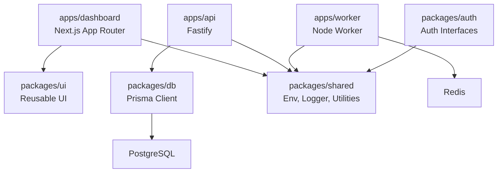

# FieldOS

| Field        | Value                                                                                      |
| ------------ | ------------------------------------------------------------------------------------------ |
| Purpose      | Introduce the FieldOS engineering foundation, repository layout, and development workflow. |
| Owner        | Founding Engineering                                                                       |
| Status       | Active                                                                                     |
| Last Updated | 2026-06-30                                                                                 |

## Table of Contents

- [Overview](#overview)
- [Architecture](#architecture)
- [Development Setup](#development-setup)
- [Commands](#commands)
- [Repository Layout](#repository-layout)
- [Development Philosophy](#development-philosophy)
- [Tech Stack](#tech-stack)
- [Current Roadmap](#current-roadmap)
- [Contributing Guidelines](#contributing-guidelines)
- [License](#license)

## Overview

FieldOS is the AI Operating System for Field Operations.

The repository is a pnpm and Turborepo monorepo containing a Next.js dashboard, a Fastify API, a standalone Redis-backed worker, and shared packages for UI, database access, authentication contracts, and cross-cutting utilities.

## Architecture

FieldOS starts as a modular monolith with clear package boundaries. The system is intentionally simple: one dashboard, one API, one worker, and a minimal PostgreSQL schema. Packages define reusable capabilities without creating service boundaries before the product requires them.



## Development Setup

Prerequisites:

- Node.js 22 or newer
- pnpm 11 or newer
- Docker Desktop or a compatible Docker runtime

Install dependencies:

```bash
pnpm install
```

Start infrastructure:

```bash
docker compose up
```

Generate Prisma client and apply migrations:

```bash
pnpm db:generate
pnpm db:migrate
```

Run the development servers:

```bash
pnpm dev
```

Default local services:

- Dashboard: `http://localhost:3000`
- API: `http://localhost:3001`
- PostgreSQL: `localhost:5432`
- Redis: `localhost:6379`

## Commands

```bash
pnpm install
pnpm dev
pnpm build
pnpm lint
pnpm test
pnpm format
pnpm typecheck
pnpm db:generate
pnpm db:migrate
```

## Repository Layout

```text
apps/
  dashboard/       Next.js App Router dashboard.
  api/             Fastify API service.
  worker/          Standalone Redis-backed worker.
packages/
  ui/              Shared UI components.
  db/              Prisma schema, migration, client, and database utilities.
  auth/            Authentication interfaces only.
  shared/          Environment helpers, logger, constants, and utilities.
docs/              Product, architecture, UX, database, roadmap, and ADR docs.
tests/             Cross-cutting and end-to-end tests.
scripts/           Development and operations scripts.
infrastructure/    Infrastructure definitions.
.github/           GitHub templates, ownership, and CI workflows.
```

## Development Philosophy

- Prefer simple, explicit code over premature abstraction.
- Keep domain and package boundaries clear.
- Treat typing, linting, tests, and formatting as part of the product.
- Document architecture decisions when they constrain future choices.
- Build production habits early, but do not build speculative features.

## Tech Stack

- TypeScript
- Turborepo
- pnpm
- Next.js App Router
- TailwindCSS
- shadcn/ui-style components
- Fastify
- Prisma ORM
- PostgreSQL
- Redis
- Zod
- TanStack Query
- Zustand
- Vitest
- Playwright
- Docker
- GitHub Actions

## Current Roadmap

1. Complete the engineering foundation.
2. Define the product requirements and initial domain model.
3. Build the first authenticated dashboard workflow.
4. Add operational observability and deployment automation.
5. Introduce AI assistance only after core workflow boundaries are stable.

## Contributing Guidelines

- Use Conventional Commits.
- Create pull requests for changes to `main`.
- Keep changes focused and update documentation when behavior or architecture changes.
- Ensure lint, typecheck, test, and build pass before merging.
- Add ADRs for architecture-impacting decisions.

## License

FieldOS is licensed under the MIT License. See [LICENSE](./LICENSE).
