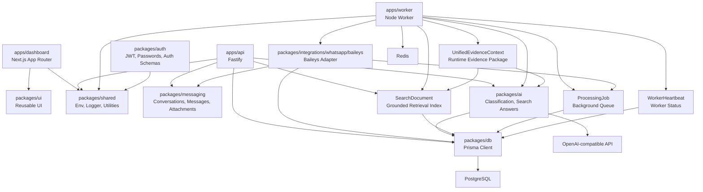

# FieldOS

| Field        | Value                                                                                      |
| ------------ | ------------------------------------------------------------------------------------------ |
| Purpose      | Introduce the FieldOS engineering foundation, repository layout, and development workflow. |
| Owner        | Founding Engineering                                                                       |
| Status       | Active                                                                                     |
| Last Updated | 2026-07-07                                                                                 |

## Table of Contents

- [Overview](#overview)
- [Architecture](#architecture)
- [Development Setup](#development-setup)
- [Commands](#commands)
- [Deployment](#deployment)
- [Operations Command Center](#operations-command-center)
- [Operations Health](#operations-health)
- [AI Search](#ai-search)
- [Unified Evidence Processing](#unified-evidence-processing)
- [Repository Layout](#repository-layout)
- [Development Philosophy](#development-philosophy)
- [Tech Stack](#tech-stack)
- [Current Roadmap](#current-roadmap)
- [Contributing Guidelines](#contributing-guidelines)
- [License](#license)

## Overview

FieldOS is the AI Operating System for Field Operations.

The repository is a pnpm and Turborepo monorepo containing a Next.js dashboard, a Fastify API, a standalone Redis-backed worker, shared packages for UI, database access, authentication, messaging, AI classification, cross-cutting utilities, and a Baileys-based WhatsApp adapter.

## Architecture

FieldOS starts as a modular monolith with clear package boundaries. The current product slice supports JWT-cookie authentication, organization workspaces, organization memberships, projects, a channel-agnostic messaging foundation, a WhatsApp Web connector that feeds messages into the unified inbox, and a human-reviewed AI classification layer for active project messages.



## Development Setup

Prerequisites:

- Node.js 22 or newer
- pnpm 11 or newer
- Docker Desktop or a compatible Docker runtime

Install dependencies:

```bash
pnpm install
```

Start infrastructure:

```bash
docker compose up
```

Generate Prisma client and apply migrations:

```bash
pnpm db:generate
pnpm db:migrate
pnpm db:seed
```

Configure AI classification by setting `OPENROUTER_API_KEY`. `AI_BASE_URL` defaults to `https://openrouter.ai/api/v1` and `AI_MODEL` defaults to `openrouter/free`. `OPENAI_API_KEY` remains supported as a fallback for OpenAI-compatible providers and is used for voice transcription when available.

Test the auth flow:

```bash
pnpm --filter @fieldos/api test
pnpm --filter @fieldos/dashboard test
```

Run the development servers:

```bash
pnpm dev
```

Default local services:

- Dashboard: `http://localhost:3000`
- API: `http://localhost:3001`
- PostgreSQL: `localhost:5432`
- Redis: `localhost:6379`

## Deployment

FieldOS uses Vercel for the dashboard and Railway for the first backend hosting target.

- Dashboard: `https://fieldos-sand.vercel.app`
- API: `https://fieldos-api-production.up.railway.app`
- Worker: Railway service `fieldos-worker`
- PostgreSQL: Railway managed PostgreSQL service `Postgres`
- Redis: Railway managed Redis service `Redis`

See [docs/09_DEPLOYMENT.md](./docs/09_DEPLOYMENT.md) for the full deployment plan, service variables, and verification steps.

## Commands

```bash
pnpm install
pnpm dev
pnpm build
pnpm lint
pnpm test
pnpm format
pnpm typecheck
pnpm db:generate
pnpm db:migrate
pnpm db:seed
```

## Repository Layout

```text
apps/
  dashboard/       Next.js App Router dashboard.
  api/             Fastify API service.
  worker/          Standalone Redis-backed worker.
packages/
  ui/              Shared UI components.
  db/              Prisma schema, migration, client, and database utilities.
  ai/              Message classification, extraction, and action item generation.
  auth/            JWT cookie auth, password hashing, and auth schemas.
  integrations/
    whatsapp/
      baileys/     WhatsApp Web adapter that ingests messages through Baileys.
  messaging/       Channel-agnostic conversation, message, and attachment services.
  shared/          Environment helpers, logger, constants, and utilities.
docs/              Product, architecture, UX, database, roadmap, and ADR docs.
tests/             Cross-cutting and end-to-end tests.
scripts/           Development and operations scripts.
infrastructure/    Infrastructure definitions.
.github/           GitHub templates, ownership, and CI workflows.
```

## Development Philosophy

- Prefer simple, explicit code over premature abstraction.
- Keep domain and package boundaries clear.
- Treat typing, linting, tests, and formatting as part of the product.
- Document architecture decisions when they constrain future choices.
- Build production habits early, but do not build speculative features.

## Tech Stack

- TypeScript
- Turborepo
- pnpm
- Next.js App Router
- TailwindCSS
- shadcn/ui-style components
- Fastify
- Prisma ORM
- PostgreSQL
- Redis
- Zod
- TanStack Query
- Zustand
- Vitest
- Playwright
- Docker
- GitHub Actions
- OpenAI-compatible Chat Completions API

## Auth and Tenancy

FieldOS uses JWT session tokens stored in HTTP-only cookies for the MVP. Passwords are hashed with bcrypt. The API owns session validation and tenant authorization.

Organizations are workspaces. Users access organizations through memberships with one of four roles: `OWNER`, `ADMIN`, `MEMBER`, or `VIEWER`.

Project creation is limited to `OWNER` and `ADMIN`. Project reads are scoped to organization membership.

## Messaging

FieldOS models all channel communication as conversations, participants, messages, and attachments. Messaging services are channel-agnostic. Channel adapters map external systems into the core model rather than changing the model itself.

Supported channel values are `WHATSAPP`, `EMAIL`, `SLACK`, `TEAMS`, and `SMS`.

## WhatsApp Connector

The current WhatsApp connector uses the maintained Baileys package for WhatsApp Web pairing. Accounts are created and managed from dashboard settings. QR payloads are exchanged through Redis, session files and media are stored under `.storage`, and inbound messages are normalized into the generic messaging tables only after an admin activates the chat or group.

FieldOS discovers WhatsApp chat and group metadata first. Discovered, ignored, and archived chats are not shown in the Inbox and do not store message bodies or attachments. Admins must explicitly activate a chat/group before new incoming messages are ingested. A project mapping is recommended, but active unmapped chats may ingest messages so FieldOS can create human-reviewed project suggestion Action Items.

Use dedicated business numbers only. Do not connect personal WhatsApp accounts. FieldOS will add the official Meta WhatsApp Cloud API path for production enterprise deployments later.

## AI Classification

FieldOS classifies only messages that already passed the WhatsApp activation gate. Classification runs asynchronously in the worker so message ingestion is never blocked by the AI provider.

The AI layer builds a `UnifiedEvidenceContext` for each message, classifies the full operational update, writes a concise summary, extracts a location when present, decides whether human action is required, and creates Action Items when review is useful. Action Items remain `PENDING` until a user accepts or ignores them; FieldOS does not automatically create operational work or reassign projects from AI output.

## Operations Health

FieldOS includes a lightweight operations health page at `/admin/operations` for organization `OWNER` and `ADMIN` users. It shows worker heartbeat, job metrics, WhatsApp account status, AI queue health, search indexing health, and media/transcription queue placeholders.

Background work is tracked in `ProcessingJob` rows. Search indexing is asynchronous: message, project, event, Action Item, and AI classification writes enqueue `SEARCH_INDEX` jobs, and the worker updates `SearchDocument`. Search endpoints only read the index.

Worker status is tracked through `WorkerHeartbeat`, updated every 30 seconds by the Railway worker. Failed jobs can be retried individually or in bulk from the operations page.

## Operations Command Center

The authenticated dashboard homepage is the Operations Command Center. It aggregates organization-scoped project health, Action Items assigned to the current user, recent business activity, upcoming milestones, and a short daily brief.

Project health is deterministic. Critical status is driven by safety classifications, several urgent Action Items, or multiple overdue milestones. Needs Attention is driven by high-priority Action Items, delivery or inspection signals, or overdue work. The AI brief must use known project, event, milestone, and Action Item data only; a deterministic fallback is returned when provider-backed generation is unavailable.

The API exposes command center data through:

- `GET /dashboard`
- `GET /dashboard/summary`
- `GET /dashboard/projects`
- `GET /dashboard/action-items`
- `GET /dashboard/recent-activity`
- `GET /dashboard/brief`

## AI Search

FieldOS includes grounded AI search across organization and project records. Search is powered by the `SearchDocument` index in PostgreSQL and covers projects, messages, timeline events, Action Items, and AI classifications.

Search indexing is maintained by background jobs, not by search requests. If a new record does not appear immediately, check `/admin/operations` for pending or failed Search Index jobs.

The API exposes:

- `GET /search`
- `POST /search/ask`
- `POST /projects/:projectId/search/ask`

Answers are grounded in retrieved FieldOS records and return cited source records. If the system cannot find enough evidence, it returns: `I could not find enough information in FieldOS to answer that.`

The dashboard includes a Search page with project, source type, and date filters. Project detail pages include a scoped `Ask about this project` panel.

## Unified Evidence Processing

FieldOS treats a WhatsApp update as one operational evidence package. `UnifiedEvidenceContext` is a runtime object, not a database table. It is built dynamically from the message, conversation, project, sender, attachments, and any available voice transcript before AI classification and search indexing.

Supported MVP evidence:

- Text message body.
- Photo metadata only.
- Voice note transcript when transcription succeeds.
- PDF/document metadata only.
- Video metadata only.

OCR, image recognition, vision models, and document extraction are intentionally deferred. Photos and PDFs are described to AI as attached evidence with filenames, MIME types, counts, and sizes only.

The API exposes:

- `GET /messages/:id/context`
- `GET /messages/:id/evidence-summary`

The inbox shows an Evidence Summary for each message with attachments, an expandable media section, and voice transcripts beneath voice evidence when available. The command center's Recent Evidence groups updates by message rather than listing each file separately.

## Current Roadmap

1. Validate unified evidence processing with a live WhatsApp text, photo, voice note, and PDF update.
2. Validate grounded AI search with production tenant data.
3. Validate WhatsApp QR pairing and explicit chat activation with dedicated business test numbers.
4. Add invite and membership management.
5. Verify operations health against sustained WhatsApp and AI traffic.
6. Add deployment automation.
7. Expand AI-assisted triage into human-approved operational tasks, reports, event timeline views, OCR, vision, document extraction, and official Meta WhatsApp Cloud API support after core workflow boundaries are stable.

## Contributing Guidelines

- Use Conventional Commits.
- Create pull requests for changes to `main`.
- Keep changes focused and update documentation when behavior or architecture changes.
- Ensure lint, typecheck, test, and build pass before merging.
- Add ADRs for architecture-impacting decisions.

## License

FieldOS is licensed under the MIT License. See [LICENSE](./LICENSE).
