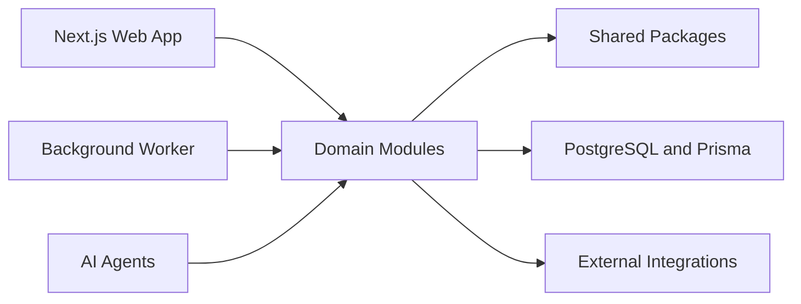

# Architecture

| Field        | Value                                                                                         |
| ------------ | --------------------------------------------------------------------------------------------- |
| Purpose      | Describe the FieldOS system architecture, boundaries, integration points, and evolution plan. |
| Owner        | Engineering                                                                                   |
| Status       | Draft                                                                                         |
| Last Updated | 2026-07-08                                                                                    |

## Table of Contents

- [Architecture Overview](#architecture-overview)
- [System Diagram](#system-diagram)
- [Module Boundaries](#module-boundaries)
- [Package Boundaries](#package-boundaries)
- [Data Flow](#data-flow)
- [Integration Strategy](#integration-strategy)
- [WhatsApp Connector](#whatsapp-connector)
- [AI Classification](#ai-classification)
- [Unified Evidence Processing](#unified-evidence-processing)
- [Photo Intelligence](#photo-intelligence)
- [Project Intelligence and Reporting](#project-intelligence-and-reporting)
- [AI Project Coordinators](#ai-project-coordinators)
- [Media Serving](#media-serving)
- [Operations Command Center](#operations-command-center)
- [Background Processing and Operations Health](#background-processing-and-operations-health)
- [AI Search](#ai-search)
- [Pilot Readiness](#pilot-readiness)
- [Event Model](#event-model)
- [Evolution Path](#evolution-path)

## Architecture Overview

FieldOS starts as a modular monolith with explicit domain and package boundaries. The architecture should support fast iteration while preserving clear ownership, testability, and future extraction paths.

## System Diagram

## Module Boundaries

Current application boundaries:

- `apps/dashboard`: Next.js App Router dashboard for authentication, organization onboarding, and project navigation.
- `apps/api`: Fastify API that owns authentication, tenant authorization, organization membership checks, and project endpoints.
- `apps/worker`: Redis-connected worker that reconciles Baileys WhatsApp sessions, updates worker heartbeat, and processes database-backed background jobs.
- `packages/auth`: Password hashing, JWT signing/verification, auth schemas, and session constants.
- `packages/ai`: AI message classification, vision analysis, extraction, prompt versioning, and action item processing.
- `packages/db`: Prisma schema, migrations, Prisma client, and database types.
- `packages/intelligence`: Deterministic project intelligence summaries and report export helpers.
- `packages/coordinators`: Project state snapshots, deterministic coordinators, recommendation rules, coordinator run logs, and WhatsApp draft orchestration.
- `packages/integrations/whatsapp/baileys`: WhatsApp Web adapter, QR store, session storage, message normalization, and ingestion.
- `packages/ui`: Reusable shadcn-style UI primitives.
- `packages/shared`: Environment, logging, API client utility, constants, and shared helpers.

## Package Boundaries

- `packages/messaging` owns channel-agnostic conversation and message business rules.
- `packages/integrations/whatsapp/baileys` owns WhatsApp-specific session state, QR pairing, history discovery, and provider payload normalization.
- `packages/ai` owns AI prompt construction, provider calls, output validation, classification persistence, photo analysis provider calls, and action item creation.
- `packages/intelligence` owns project brief/report composition and export formatting. It consumes prepared records and does not call external providers.
- `packages/coordinators` owns coordinator rules and recommendation lifecycle. It reads persisted project state and evidence, writes `Recommendation` and `CoordinatorRun`, and never sends messages without a human-confirmed draft send.
- `apps/api` owns authentication, tenant authorization, and external HTTP contracts.
- `apps/worker` owns asynchronous processing loops, worker heartbeat, and background job execution. It must keep provider failures and search indexing out of request and ingestion paths.

## Data Flow

Authentication flow:

1. A user signs up or logs in through the dashboard.
2. The dashboard calls the Fastify API with JSON requests.
3. The API validates input with Zod.
4. Passwords are hashed with bcrypt.
5. A signed JWT is stored in an HTTP-only cookie.
6. Protected routes read the cookie, verify the JWT, load the current user, and apply tenant role checks.

Password security flow:

1. Authenticated password changes verify the current bcrypt hash before writing a new hash.
2. Password changes increment `User.sessionVersion`, invalidating every existing JWT session.
3. Forgot-password requests always return the same response whether or not the email exists.
4. Existing users receive a random reset token through the configured email adapter; PostgreSQL stores only its SHA-256 hash.
5. Reset tokens expire after one hour and are consumed atomically with the password update.
6. Successful resets increment `User.sessionVersion` and invalidate all outstanding reset tokens.

Organization and project flow:

1. A user creates an organization.
2. The API creates an `OWNER` membership for that user.
3. Owners and administrators create seven-day team invitations; only token hashes are persisted.
4. Invited users sign up or log in with the exact invited email and accept the invitation once.
5. `OWNER` and `ADMIN` memberships access all projects. Restricted `MEMBER` and `VIEWER` memberships resolve projects through `ProjectAccess`.
6. Project, dashboard, search, conversation, message, and attachment reads apply the same project-access boundary.
7. Project creation and integration management are limited to `OWNER` and `ADMIN` roles.

## Integration Strategy

The dashboard talks to the API over HTTP using credentialed JSON requests. The API is the only layer that directly enforces authentication and organization authorization.

Channel adapters live outside `packages/messaging`. They translate provider events into generic conversations, participants, messages, and attachments.

## WhatsApp Connector

The Baileys WhatsApp connector is worker-owned. The dashboard creates and manages `WhatsAppAccount` records through the API, the worker starts sessions for accounts in active connection states, and QR payloads are shared through Redis.

Inbound WhatsApp metadata is discovered by the adapter and stored in `WhatsAppChatMapping` without creating inbox conversations. Message content is normalized and persisted into the generic messaging model only after an organization admin activates the chat/group. Project mapping is optional at ingestion time so AI can recommend a project when the active chat is unmapped or appears to reference a different project.

Chat-to-project mapping is stored separately in `WhatsAppChatMapping`, then reflected onto `Conversation.projectId` when a conversation exists so the inbox and project views remain channel-agnostic.

The ingestion privacy gate is:

1. WhatsApp account status is `CONNECTED`.
2. Chat mapping exists.
3. Chat mapping status is `ACTIVE`.

If any condition fails, the worker skips the message before reading or storing message body content.

Baileys auth session files remain under `.storage`. Downloaded WhatsApp evidence media is written through `StorageProvider`, using local filesystem storage in development and Cloudflare R2 in production.

## AI Classification

AI classification runs after message persistence, never before it. WhatsApp ingestion creates or updates a pending classification row only for messages that belong to active conversations.

The worker polls pending `AIMessageClassification` rows, builds a `UnifiedEvidenceContext`, sends that context to the OpenAI-compatible provider, validates strict JSON output, stores a concise user-facing summary and reasoning statement, and optionally creates an `ActionItem`.

Action Items are not operational tasks. They are human-review records that can be accepted or ignored through the API and dashboard. Future task-domain work can convert accepted follow-up Action Items into first-class task records.

Project suggestions are represented as `ActionItem` records with type `PROJECT_SUGGESTION`. Accepting one updates the conversation and WhatsApp chat mapping to the suggested project. Ignoring one records the human decision without changing project assignment.

## Unified Evidence Processing

`UnifiedEvidenceContext` is the runtime package that represents one operational update. It is not a table. It is built from:

- Message text.
- Conversation and sender metadata.
- Project metadata when mapped.
- Attachment metadata and linked photo analysis when available.
- Voice transcript when available.
- Evidence summary counts for photos, voice notes, PDFs, documents, and videos.

The context is the single input to AI classification. AI is told that the transcript belongs to the same WhatsApp update as the text and attachments. Photos are initially represented as metadata, then asynchronously enriched by Photo Intelligence when the image file is available. PDFs, documents, and videos remain metadata-only for the MVP.

The worker processing order for inbound WhatsApp evidence is:

1. Store message.
2. Store/download media metadata and file when possible.
3. Queue voice transcription for voice attachments.
4. Build `UnifiedEvidenceContext`.
5. Queue photo analysis for image attachments.
6. Run AI classification.
7. Create a grouped message timeline event.
8. Create Action Items when required.
9. Queue search indexing.

Media and transcription failures are non-blocking. Attachment rows record transcription status and error text, failed jobs remain retryable, and AI classification continues with the evidence that is available.

Search indexing for messages includes message text, voice transcript text, evidence summary, and attachment filenames. Photo analysis summaries are indexed separately after vision processing. Binary content is not indexed.

The API exposes `GET /messages/:id/context` and `GET /messages/:id/evidence-summary` so UI surfaces can display the full evidence package or a compact summary without rebuilding logic locally.

## Photo Intelligence

Photo Intelligence is worker-owned asynchronous enrichment for image attachments. The WhatsApp adapter stores the attachment and queues a `PHOTO_ANALYSIS` job; the worker reads the stored file, calls the configured OpenAI-compatible vision provider, validates compact JSON, and upserts a `PhotoAnalysis` row.

The persisted output is intentionally small:

- `summary`
- `detectedObjects`
- `possibleIssues`
- `confidence`
- `tags`

Vision output is advisory. It can help field teams notice possible issues, but it never certifies completion, safety, compliance, or defect presence without human review.

Photo analysis results are visible in the inbox, project detail page, command-center recent evidence snippets, admin operations health, and AI Search. The API exposes project-scoped and evidence-scoped read routes while keeping authorization organization-scoped.

## Project Intelligence and Reporting

Project Intelligence is grounded summarization over FieldOS records. The API builds a `ProjectIntelligenceContext` from timeline events, Action Items, AI classifications, photo analyses, voice transcripts, evidence metadata, and milestones, then passes that context to `packages/intelligence`.

The intelligence package exposes:

- `generateMorningBrief()`
- `generateDailySummary()`
- `generateWeeklyReport()`
- `generateRiskSummary()`
- `generatePendingDecisions()`

The service is deterministic for the MVP. It does not call an AI provider and it does not store hidden reasoning. Every report section carries lightweight source references so UI surfaces can link back to messages, evidence, Action Items, events, and analyses.

Report generation can run synchronously for ad hoc export or asynchronously through `REPORT_GENERATION` jobs. Worker-generated reports are cached in `ProjectReport`, export Markdown and PDF, create a timeline event, and queue search indexing for the completed report.

## AI Project Coordinators

AI Project Coordinators are the active recommendation layer. They use `ProjectState` as a shared snapshot so the Progress, Follow-up, Inspection, and Report coordinators do not repeatedly scan full project history.

Coordinator logic is deterministic-first:

- Health, stale-update thresholds, open Action Item counts, report readiness, deduplication, and approval state are computed from database records.
- AI prompts are versioned in `packages/ai/src/prompts`, but model output is limited to concise summaries and draft wording.
- Recommendations are persisted in `Recommendation` and require human approval before FieldOS creates Action Items, queues reports, or creates WhatsApp drafts.

The worker queues `PROJECT_COORDINATOR` jobs after relevant processing events and also schedules an hourly scan of active projects. `CoordinatorRun` records run status, failures, and recommendation counts for `/admin/operations`.

Project intelligence API endpoints:

- `GET /projects/:projectId/intelligence`
- `GET /projects/:projectId/morning-brief`
- `GET /projects/:projectId/daily-summary`
- `GET /projects/:projectId/weekly-report`
- `GET /projects/:projectId/risks`
- `GET /projects/:projectId/pending-decisions`
- `POST /projects/:projectId/reports/generate`

Dashboard intelligence surfaces must remain presentation-oriented. They call API endpoints, render report sections, request exports, and open evidence through the reusable Evidence Viewer.

## Media Serving

FieldOS uses a `StorageProvider` abstraction with `upload()`, `download()`, `getSignedUrl()`, `delete()`, and `exists()` methods. `LocalStorageProvider` is the local implementation and signs API media URLs with `MEDIA_SIGNING_SECRET`. `R2StorageProvider` is the production implementation and uses Cloudflare R2 through the S3-compatible API.

The dashboard never receives raw storage keys. It requests evidence through `GET /evidence/:id/view`, receives a short-lived signed URL, and previews media from that URL. Local development URLs point back through `GET /media/:token`; production URLs point at R2 signed URLs.

Production deployments set `STORAGE_PROVIDER=r2`. API and worker validate the required R2 environment variables at startup and fail fast if the provider is incomplete.

Object keys are safe and tenant-namespaced:

- `organizations/{organizationId}/projects/{projectId}/evidence/{evidenceId}/{filename}`
- `organizations/{organizationId}/projects/{projectId}/reports/{reportId}.pdf`

## Operations Command Center

The Operations Command Center is the authenticated homepage. The dashboard remains presentation-oriented and consumes organization-scoped aggregates from the API instead of calculating health locally.

The API owns:

- Tenant authorization for dashboard endpoints.
- Deterministic project health calculations.
- Project attention ranking.
- Personal Action Item grouping by priority.
- Recent business activity filtering.
- Upcoming milestone retrieval.
- Daily brief fallback generation.

Project health is intentionally not AI-driven. AI may contribute source records, such as classifications and Action Items, but final homepage status is calculated from explicit rules and thresholds.

Command center endpoints:

- `GET /dashboard`
- `GET /dashboard/summary`
- `GET /dashboard/projects`
- `GET /dashboard/action-items`
- `GET /dashboard/recent-activity`
- `GET /dashboard/brief`

## Background Processing and Operations Health

FieldOS uses a lightweight database-backed job table for MVP background processing. `ProcessingJob` tracks job type, status, source record, attempts, error message, timestamps, and correlation ID. This avoids introducing a workflow platform before the product needs one.

Supported job types are:

- `SEARCH_INDEX`
- `AI_CLASSIFICATION`
- `VOICE_TRANSCRIPTION`
- `MEDIA_DOWNLOAD`
- `PHOTO_ANALYSIS`
- `REPORT_GENERATION`

The worker claims pending jobs, marks them running, logs job ID, organization ID, optional project ID, duration, result, and correlation ID, then marks jobs completed or failed. Failed jobs can be retried individually or in bulk through admin routes.

`Message.processingStatus` stores a support-friendly view of message progress across receipt, media, transcription, search, AI, and failure states. It is not a workflow engine; it exists so developers and support engineers can quickly inspect where a message is stuck.

`WorkerHeartbeat` stores worker name, version, status, and last heartbeat. The worker updates heartbeat every 30 seconds. API responses treat stale online heartbeats as effectively offline.

Admin operations endpoints are restricted to organization `OWNER` and `ADMIN` roles:

- `GET /admin/operations`
- `GET /admin/jobs`
- `POST /admin/jobs/:id/retry`
- `POST /admin/jobs/retry-failed`
- `GET /admin/workers`

## AI Search

AI search is grounded retrieval, not an open-ended assistant. The API owns search authorization, record retrieval, answer generation, and fallback behavior.

Search records are normalized into `SearchDocument` rows with an organization scope, optional project scope, source type, source id, title, content, metadata, and occurrence timestamp. The first implementation indexes projects, messages, timeline events, Action Items, AI classifications, and photo analyses.

Search indexing is asynchronous. Project, message, timeline event, Action Item, AI classification, photo analysis, and completed project report writes enqueue `SEARCH_INDEX` jobs. The worker owns all `SearchDocument` writes. Search request handlers only read the index.

Search API endpoints:

- `GET /search`: Organization-scoped keyword search with optional project, source type, date, limit, and cursor filters.
- `POST /search/ask`: Organization-scoped grounded answer generation.
- `POST /projects/:projectId/search/ask`: Project-scoped grounded answer generation.

The answer flow is:

1. Validate the user session and organization or project access.
2. Search `SearchDocument` for relevant records.
3. If no records are found, return the deterministic not-enough-information fallback.
4. Send only retrieved source snippets to the AI answer generator.
5. Return the answer, confidence, and cited source records.

The dashboard consumes this contract through a global Search page and a project-scoped ask panel. It does not build prompts or perform search ranking locally.

## Pilot Readiness

Sprint 14 adds pilot-readiness primitives without changing core domain boundaries.

- The API owns demo reset, onboarding state, feedback, notification, and analytics routes.
- The dashboard renders pilot setup progress, feedback, notifications, mobile navigation, and demo reset controls.
- Demo data is realistic aviation data but remains isolated through `Organization.isDemo`.
- Product analytics are database events for internal review, not a replacement for an analytics warehouse.
- Notifications are lightweight and user-scoped. They can later evolve into email, push, or team notifications.

## Event Model

`Event` is a generic timeline preparation model. It records organization-scoped activity from messages, Action Items, reports, and system events without building a timeline UI yet.

The model is intentionally small: source type, source id, event type, title, optional description, occurrence time, and creation time. Task 008 can consume these records without coupling timeline logic to messaging, AI, or connector internals.

## Evolution Path

Near-term evolution should keep the API as the authorization boundary. Future additions can add invite flows, organization settings, audit logging, session revocation, official Meta WhatsApp Cloud API support, first-class tasks, and richer role permissions without changing the core membership model.
