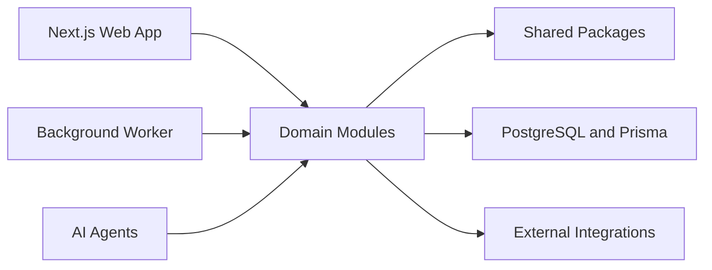

# Architecture

| Field        | Value                                                                                         |
| ------------ | --------------------------------------------------------------------------------------------- |
| Purpose      | Describe the FieldOS system architecture, boundaries, integration points, and evolution plan. |
| Owner        | Engineering                                                                                   |
| Status       | Draft                                                                                         |
| Last Updated | 2026-07-03                                                                                    |

## Table of Contents

- [Architecture Overview](#architecture-overview)
- [System Diagram](#system-diagram)
- [Module Boundaries](#module-boundaries)
- [Package Boundaries](#package-boundaries)
- [Data Flow](#data-flow)
- [Integration Strategy](#integration-strategy)
- [WhatsApp Connector](#whatsapp-connector)
- [AI Classification](#ai-classification)
- [Evolution Path](#evolution-path)

## Architecture Overview

FieldOS starts as a modular monolith with explicit domain and package boundaries. The architecture should support fast iteration while preserving clear ownership, testability, and future extraction paths.

## System Diagram

## Module Boundaries

Current application boundaries:

- `apps/dashboard`: Next.js App Router dashboard for authentication, organization onboarding, and project navigation.
- `apps/api`: Fastify API that owns authentication, tenant authorization, organization membership checks, and project endpoints.
- `apps/worker`: Redis-connected worker that reconciles background sessions, including Baileys WhatsApp sessions.
- `packages/auth`: Password hashing, JWT signing/verification, auth schemas, and session constants.
- `packages/ai`: AI message classification, extraction, prompt versioning, and suggested task processing.
- `packages/db`: Prisma schema, migrations, Prisma client, and database types.
- `packages/integrations/whatsapp/baileys`: WhatsApp Web adapter, QR store, session storage, message normalization, and ingestion.
- `packages/ui`: Reusable shadcn-style UI primitives.
- `packages/shared`: Environment, logging, API client utility, constants, and shared helpers.

## Package Boundaries

- `packages/messaging` owns channel-agnostic conversation and message business rules.
- `packages/integrations/whatsapp/baileys` owns WhatsApp-specific session state, QR pairing, history discovery, and provider payload normalization.
- `packages/ai` owns AI prompt construction, provider calls, output validation, classification persistence, and suggested task creation.
- `apps/api` owns authentication, tenant authorization, and external HTTP contracts.
- `apps/worker` owns asynchronous processing loops and must keep provider failures out of request and ingestion paths.

## Data Flow

Authentication flow:

1. A user signs up or logs in through the dashboard.
2. The dashboard calls the Fastify API with JSON requests.
3. The API validates input with Zod.
4. Passwords are hashed with bcrypt.
5. A signed JWT is stored in an HTTP-only cookie.
6. Protected routes read the cookie, verify the JWT, load the current user, and apply tenant role checks.

Organization and project flow:

1. A user creates an organization.
2. The API creates an `OWNER` membership for that user.
3. Project queries are scoped through organization membership.
4. Project creation is limited to `OWNER` and `ADMIN` roles.

## Integration Strategy

The dashboard talks to the API over HTTP using credentialed JSON requests. The API is the only layer that directly enforces authentication and organization authorization.

Channel adapters live outside `packages/messaging`. They translate provider events into generic conversations, participants, messages, and attachments.

## WhatsApp Connector

The Baileys WhatsApp connector is worker-owned. The dashboard creates and manages `WhatsAppAccount` records through the API, the worker starts sessions for accounts in active connection states, and QR payloads are shared through Redis.

Inbound WhatsApp metadata is discovered by the adapter and stored in `WhatsAppChatMapping` without creating inbox conversations. Message content is normalized and persisted into the generic messaging model only after an organization admin activates the chat/group and maps it to a project.

Chat-to-project mapping is stored separately in `WhatsAppChatMapping`, then reflected onto `Conversation.projectId` when a conversation exists so the inbox and project views remain channel-agnostic.

The ingestion privacy gate is:

1. WhatsApp account status is `CONNECTED`.
2. Chat mapping exists.
3. Chat mapping status is `ACTIVE`.
4. Chat mapping has `projectId`.

If any condition fails, the worker skips the message before reading or storing message body content.

Session files and downloaded media are currently stored under `.storage`. This is acceptable for local development and must move to production object storage before deployment.

## AI Classification

AI classification runs after message persistence, never before it. WhatsApp ingestion creates or updates a pending classification row only for messages that belong to active, project-mapped conversations.

The worker polls pending `AIMessageClassification` rows, sends normalized message context to the OpenAI-compatible provider, validates strict JSON output, stores a user-facing summary of the result, and optionally creates a `SuggestedTask`.

Suggested tasks are not operational tasks. They are human-review records that can be accepted or rejected through the API and dashboard. Future task-domain work can convert accepted suggestions into first-class task records.

## Evolution Path

Near-term evolution should keep the API as the authorization boundary. Future additions can add invite flows, organization settings, audit logging, session revocation, official Meta WhatsApp Cloud API support, first-class tasks, and richer role permissions without changing the core membership model.
