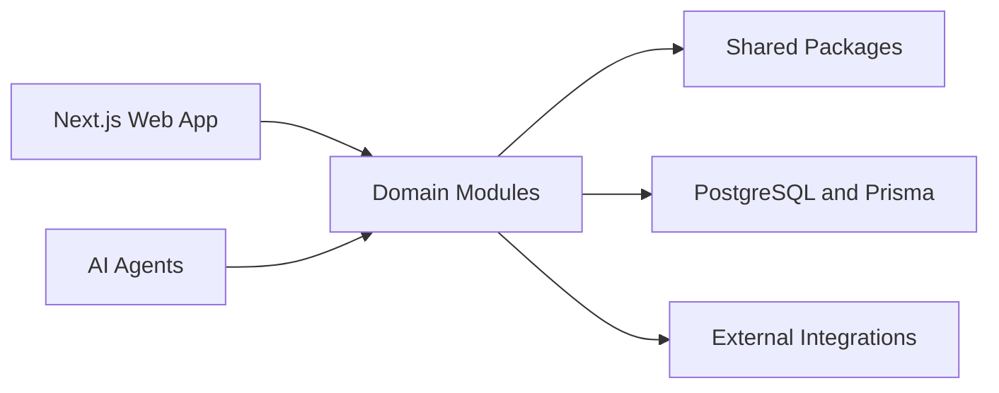

# Architecture

| Field        | Value                                                                                         |
| ------------ | --------------------------------------------------------------------------------------------- |
| Purpose      | Describe the FieldOS system architecture, boundaries, integration points, and evolution plan. |
| Owner        | Engineering                                                                                   |
| Status       | Draft                                                                                         |
| Last Updated | 2026-06-30                                                                                    |

## Table of Contents

- [Architecture Overview](#architecture-overview)
- [System Diagram](#system-diagram)
- [Module Boundaries](#module-boundaries)
- [Package Boundaries](#package-boundaries)
- [Data Flow](#data-flow)
- [Integration Strategy](#integration-strategy)
- [Evolution Path](#evolution-path)

## Architecture Overview

FieldOS starts as a modular monolith with explicit domain and package boundaries. The architecture should support fast iteration while preserving clear ownership, testability, and future extraction paths.

## System Diagram

## Module Boundaries

Placeholder.

## Package Boundaries

Placeholder.

## Data Flow

Placeholder.

## Integration Strategy

Placeholder.

## Evolution Path

Placeholder.
