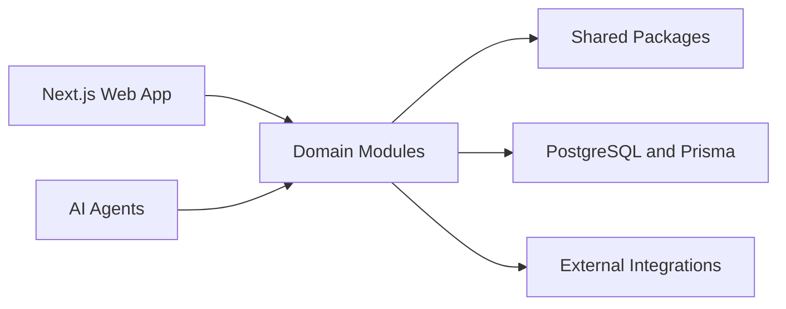

# Architecture

| Field        | Value                                                                                         |
| ------------ | --------------------------------------------------------------------------------------------- |
| Purpose      | Describe the FieldOS system architecture, boundaries, integration points, and evolution plan. |
| Owner        | Engineering                                                                                   |
| Status       | Draft                                                                                         |
| Last Updated | 2026-07-01                                                                                    |

## Table of Contents

- [Architecture Overview](#architecture-overview)
- [System Diagram](#system-diagram)
- [Module Boundaries](#module-boundaries)
- [Package Boundaries](#package-boundaries)
- [Data Flow](#data-flow)
- [Integration Strategy](#integration-strategy)
- [WhatsApp Connector](#whatsapp-connector)
- [Evolution Path](#evolution-path)

## Architecture Overview

FieldOS starts as a modular monolith with explicit domain and package boundaries. The architecture should support fast iteration while preserving clear ownership, testability, and future extraction paths.

## System Diagram

## Module Boundaries

Current application boundaries:

- `apps/dashboard`: Next.js App Router dashboard for authentication, organization onboarding, and project navigation.
- `apps/api`: Fastify API that owns authentication, tenant authorization, organization membership checks, and project endpoints.
- `apps/worker`: Redis-connected worker that reconciles background sessions, including Baileys WhatsApp sessions.
- `packages/auth`: Password hashing, JWT signing/verification, auth schemas, and session constants.
- `packages/db`: Prisma schema, migrations, Prisma client, and database types.
- `packages/integrations/whatsapp/baileys`: WhatsApp Web adapter, QR store, session storage, message normalization, and ingestion.
- `packages/ui`: Reusable shadcn-style UI primitives.
- `packages/shared`: Environment, logging, API client utility, constants, and shared helpers.

## Package Boundaries

Placeholder.

## Data Flow

Authentication flow:

1. A user signs up or logs in through the dashboard.
2. The dashboard calls the Fastify API with JSON requests.
3. The API validates input with Zod.
4. Passwords are hashed with bcrypt.
5. A signed JWT is stored in an HTTP-only cookie.
6. Protected routes read the cookie, verify the JWT, load the current user, and apply tenant role checks.

Organization and project flow:

1. A user creates an organization.
2. The API creates an `OWNER` membership for that user.
3. Project queries are scoped through organization membership.
4. Project creation is limited to `OWNER` and `ADMIN` roles.

## Integration Strategy

The dashboard talks to the API over HTTP using credentialed JSON requests. The API is the only layer that directly enforces authentication and organization authorization.

Channel adapters live outside `packages/messaging`. They translate provider events into generic conversations, participants, messages, and attachments.

## WhatsApp Connector

The Baileys WhatsApp connector is worker-owned. The dashboard creates and manages `WhatsAppAccount` records through the API, the worker starts sessions for accounts in active connection states, and QR payloads are shared through Redis.

Inbound WhatsApp messages are normalized by the adapter and persisted into the generic messaging model. Chat-to-project mapping is stored separately in `WhatsAppChatMapping`, then reflected onto `Conversation.projectId` so the inbox and project views remain channel-agnostic.

Session files and downloaded media are currently stored under `.storage`. This is acceptable for local development and must move to production object storage before deployment.

## Evolution Path

Near-term evolution should keep the API as the authorization boundary. Future additions can add invite flows, organization settings, audit logging, session revocation, official Meta WhatsApp Cloud API support, and richer role permissions without changing the core membership model.
