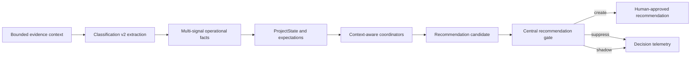

# AI Decision Layer v2

| Field        | Value                                                                              |
| ------------ | ---------------------------------------------------------------------------------- |
| Purpose      | Define the precision-first FieldOS classification and recommendation architecture. |
| Owner        | Principal AI Engineering                                                           |
| Status       | Shadow rollout                                                                     |
| Last Updated | 2026-07-21                                                                         |

## Table of Contents

- [Root Causes](#root-causes)
- [Architecture](#architecture)
- [Classification Schema](#classification-schema)
- [Context Assembly](#context-assembly)
- [Recommendation Flow](#recommendation-flow)
- [Coordinator Policies](#coordinator-policies)
- [Photo Policy](#photo-policy)
- [Milestone Policy](#milestone-policy)
- [Deduplication](#deduplication)
- [Shadow Rollout](#shadow-rollout)
- [Evaluation](#evaluation)
- [Limitations](#limitations)
- [Rollback](#rollback)

## Root Causes

The legacy path converted an isolated model boolean directly into an Action Item, treated ordinary progress as review work, treated conversation silence as a missing update, and used broad completion keywords for inspection. Although `ProjectState` was rebuilt before coordinator execution, most coordinators did not receive or use it. Deduplication only covered pending records and did not protect dismissed decisions from immediate regeneration.

## Architecture

The worker owns extraction and coordinator execution. The API remains the owner of authenticated approval mutations. The modular monolith keeps AI extraction in `packages/ai`, project decisions in `packages/coordinators`, and persistence in `packages/db`.

## Classification Schema

Classification v2 records:

- relevance: operational, non-operational, or ambiguous
- primary category and up to five secondary signals
- operational impact
- structured response expectation
- completion claim and inspection-readiness claim
- recommendation eligibility and explicit abstention reason
- concise summary, uncertainty, user-facing reason, location, and confidence
- schema version, prompt version, model, provider chain, and processing timestamp

Eligibility is extraction metadata, not permission to create work. The recommendation gate makes the final deterministic decision.

## Context Assembly

Message extraction receives at most eight recent conversation messages, ten active milestones, ten open Action Items, ten recent timeline events, and the current `ProjectState`. Coordinator execution receives one bounded context containing Project, ProjectState, active milestones, recent v2 classifications, open expectations, open Action Items, recent recommendation history, recent reports, and meaningful timeline events.

Unlimited project-history scans are not used.

## Recommendation Flow

Every v2 recommendation starts as a `RecommendationCandidate`. The central gate requires evidence, an active project, sufficient confidence, and a useful non-generic action. It records created, suppressed, and shadow decisions with a safe semantic fingerprint and reason code.

No v2 coordinator writes a recommendation directly.

## Coordinator Policies

- Progress: routine updates update knowledge only. A candidate requires a material delay, defect, safety issue, approval dependency, RFI, variation, material issue, or manpower issue.
- Follow-up: silence is never sufficient. A persisted open expectation must identify the requested item and be overdue. Drafts reference that item and its source date.
- Inspection: requires explicit scope, claimed completion, explicit inspection intent, high confidence, no open inspection, and no unresolved prerequisite.
- Report: requires the configured weekly reporting day, substantive events, a meaningful project summary, and no existing report for the period.
- Milestone: actionable changes require explicit milestone scope. `NONE` may have null title, status, and dates.

## Photo Policy

Photo analysis stores visible observations, detected objects, sender claim, claim assessment, limitations, and an operational conclusion. `NO_OPERATIONAL_CONCLUSION` is the safe default. A single photo cannot certify completion, compliance, workmanship, quantities, hidden wiring, test results, location, asset operation, or absence outside the frame.

## Milestone Policy

Generic completion language does not create a milestone without clear scope. Existing milestone matching is preferred. Partial or ambiguous completion abstains. Historical milestone and recommendation records remain unchanged.

## Deduplication

The gate fingerprints project, recommendation type, action, normalized scope, and source. Pending duplicates are suppressed. Dismissed recommendations receive a 30-day cooldown; approved or completed recommendations receive a seven-day cooldown. Later resolved expectations are marked resolved and no longer qualify for follow-up.

## Shadow Rollout

`AI_DECISION_ENGINE_MODE` accepts:

- `legacy`: legacy classifications and recommendations only
- `shadow`: legacy customer behavior plus persisted v2 classifications, candidates, and suppressions; no v2 customer-visible recommendations
- `v2`: v2 compatibility classification plus gate-created recommendations

Production starts in `shadow`. Switching the worker variable back to `legacy` is the rollback mechanism.

## Evaluation

The provider-backed acceptance harness contains 86 labelled construction, M&E, facilities, infrastructure, aviation, photo-caption, and voice-transcript cases. The accepted Kimi run had zero provider failures, 100% recommendation precision and recall, 100% abstention accuracy, and zero inspection, follow-up, or duplicate false positives. Results and methodology are in `docs/AI_EVALUATION_REPORT.md`.

## Limitations

The labelled suite uses the live provider path but synthetic messages; it does not establish quality on customer traffic. Primary-category accuracy is 88.37%, while multi-signal precision and recall are 53.57% and 46.88%, respectively. Shadow telemetry must be reviewed before v2 activation. Reporting cadence is currently the project weekly reporting policy; per-conversation cadence remains deferred.

## Rollback

1. Set Railway worker `AI_DECISION_ENGINE_MODE=legacy`.
2. Redeploy only `fieldos-worker`.
3. Confirm worker heartbeat, WhatsApp reconnect, classification completion, and coordinator jobs.
4. Keep additive v2 tables in place; they do not affect legacy reads and require no destructive rollback.
