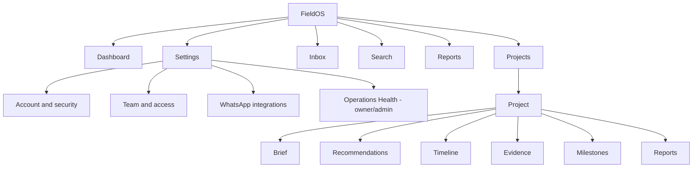

# FieldOS UX Audit

| Field        | Value                                                               |
| ------------ | ------------------------------------------------------------------- |
| Purpose      | Record the pilot UX review, redesign decisions, and remaining gaps. |
| Owner        | Product Engineering                                                 |
| Status       | Implemented                                                         |
| Last Updated | 2026-07-14                                                          |

## Table of Contents

- [Executive Summary](#executive-summary)
- [Prioritized Findings](#prioritized-findings)
- [Screen Audit](#screen-audit)
- [Information Architecture](#information-architecture)
- [Before and After](#before-and-after)
- [Responsive and Accessibility Review](#responsive-and-accessibility-review)
- [Known Issues](#known-issues)
- [Verification](#verification)

## Executive Summary

The pre-sprint application exposed most of FieldOS's technical capabilities directly in the navigation and on the dashboard. It was powerful but difficult to scan, especially for a new pilot user deciding what to do next. The redesign establishes a five-destination product shell, makes recommendations the primary decision surface, and organizes project information around the operational sequence of brief, recommendations, timeline, evidence, milestones, and reports.

The API and domain model remain unchanged. This sprint is a presentation and interaction refactor, with small client-state reliability fixes where the audit found visible product defects.

## Prioritized Findings

| Priority | Finding                                                                             | Resolution                                                                                                  |
| -------- | ----------------------------------------------------------------------------------- | ----------------------------------------------------------------------------------------------------------- |
| P0       | Active workspace was not persisted across hard navigation.                          | Persisted the active organization with Zustand storage.                                                     |
| P0       | Dashboard presented ten competing panels and no clear next action.                  | Reduced it to attention summary, recommendations, assigned Action Items, and ten recent events.             |
| P1       | Seven primary destinations exposed support and admin concepts to ordinary users.    | Standardized navigation to Dashboard, Projects, Inbox, Search, and Reports; moved utilities under Settings. |
| P1       | Project detail mixed twelve product concepts without an operating hierarchy.        | Reordered the page to Brief, Recommendations, Timeline, Evidence, Milestones, and Reports.                  |
| P1       | Inbox required table scanning and route changes to inspect a conversation.          | Added a two-pane desktop inbox, card list on mobile, preview, unread cues, and operational filters.         |
| P1       | Recommendation detail exposed raw action JSON and weakly explained approval impact. | Added human-readable outcomes, evidence, confidence, WhatsApp draft preview, and review actions.            |
| P1       | Search treated the answer and raw result list as equal-weight panels.               | Rebuilt search as a vertical question, answer, evidence, message, and event flow.                           |
| P2       | Loading and empty states varied by page.                                            | Added shared Skeleton, EmptyState, and PageHeader components.                                               |
| P2       | Mobile navigation competed with horizontal page navigation.                         | Added a fixed five-item bottom bar and compact mobile header.                                               |
| P2       | Inbox read-state hydration could loop when organization objects changed identity.   | Keyed hydration to stable organization IDs.                                                                 |

## Screen Audit

### Login

**Purpose:** Authenticate a returning user and preserve invitation context.

**Problems found:** Authentication works, but it remains visually separate from the new product shell. Password reset and invitation paths are functional but deserve a dedicated copy review.

**Improvement:** Retained the proven flow during this no-feature sprint. A focused auth polish pass is ranked P2.

### Dashboard

**Purpose:** Answer: "What needs my attention today?"

**Problems found:** Pilot setup, tours, project tables, briefs, evidence, milestones, and recommendations all competed above the fold.

**Improvement:** Added a greeting and four concise signals, made recommendations the largest surface, limited work to assigned Action Items, and capped activity at ten events.

### Projects and Project Detail

**Purpose:** Find a project, understand its current state, and review evidence-backed decisions.

**Problems found:** Project detail used implementation-oriented headings and repeated AI concepts across the page.

**Improvement:** Established the product order: Project Brief, Recommendations, Timeline, Evidence, Milestones, Reports. Coordinator controls, Ask FieldOS, and Action Items remain available as supporting details.

### Inbox

**Purpose:** Triage operational conversations and inspect their evidence.

**Problems found:** The wide table was difficult to scan, especially on mobile, and detail required a context switch.

**Improvement:** Added All, Unread, Groups, Direct, and Unassigned filters; a desktop split view; mobile list-to-detail behavior; project and channel context; and local unread cues.

### Recommendations

**Purpose:** Let a human decide whether FieldOS should act on evidence.

**Problems found:** Recommendation rationale and approval effects were weak, while implementation payloads were prominent.

**Improvement:** Standardized cards around what happened, why it matters, what approval will do, supporting evidence, confidence, and available WhatsApp drafts. Actions are Approve, Edit, Snooze 24h, and Dismiss where supported.

### Action Items

**Purpose:** Present reviewable and assigned operational work.

**Problems found:** Completion required too much navigation and priority was visually quiet.

**Improvement:** Added inline completion, priority bars, assigned/overdue/completed tabs, and compact accept/dismiss actions. Due-date support is explicitly deferred because it is not present in the current ActionItem model.

### Timeline

**Purpose:** Show a chronological, evidence-backed record of project activity.

**Problems found:** Timeline was easy to miss among many project panels.

**Improvement:** Promoted Timeline to a first-class project section and retained event source context.

### Search

**Purpose:** Ask an operational question and inspect the evidence behind the answer.

**Problems found:** Equal-width columns made raw search results compete with the synthesized answer.

**Improvement:** Added a centered question flow, recent and suggested searches, answer-first hierarchy, evidence grouping, and the global `Ctrl+K` / `Cmd+K` shortcut.

### Reports

**Purpose:** Provide one product-level entry point to project intelligence and exports.

**Problems found:** Reports existed only inside project routes and were not discoverable from primary navigation.

**Improvement:** Added a report hub that lists accessible projects and links directly to their intelligence workspaces.

### Settings and WhatsApp

**Purpose:** Manage account security, team access, integrations, and operational administration.

**Problems found:** Settings was long, while Operations Health appeared as a primary destination for every user.

**Improvement:** Added account, team, and integration anchors. Operations Health is linked only for owners and admins. WhatsApp remains under Integrations.

## Information Architecture

Desktop uses a persistent left navigation. Mobile uses the same five primary destinations in a fixed bottom tab bar, with Settings in the compact header.

## Before and After

| Surface    | Before                                             | After                                                                             |
| ---------- | -------------------------------------------------- | --------------------------------------------------------------------------------- |
| Dashboard  | Many equal-weight technical and pilot panels.      | Attention-first summary with recommendations, assigned work, and recent activity. |
| Project    | Twelve loosely ordered capabilities.               | Six operational sections with supporting tools collapsed.                         |
| Inbox      | Wide list table and separate detail page.          | Filterable conversation cards and in-place preview.                               |
| Search     | Answer and raw results competed in columns.        | Vertical question, answer, evidence, and source flow.                             |
| Navigation | Product, support, and admin routes mixed together. | Five primary destinations plus role-aware Settings.                               |

Screenshots are stored under `docs/screenshots/ux-refactor/before` and `docs/screenshots/ux-refactor/after`. They cover Dashboard, Projects, Project Detail, Inbox, Recommendations, Action Items, Search, and mobile navigation where data is available.

After screenshots:

- [Dashboard](./screenshots/ux-refactor/after/dashboard.png)
- [Project Detail](./screenshots/ux-refactor/after/project.png)
- [Inbox](./screenshots/ux-refactor/after/inbox.png)
- [Recommendations](./screenshots/ux-refactor/after/recommendations.png)
- [Action Items](./screenshots/ux-refactor/after/action-items.png)
- [Search](./screenshots/ux-refactor/after/search.png)
- [Mobile Dashboard](./screenshots/ux-refactor/after/mobile-dashboard.png)

Before screenshots:

- [Dashboard](./screenshots/ux-refactor/before/dashboard.png)
- [Projects](./screenshots/ux-refactor/before/projects.png)
- [Project Detail](./screenshots/ux-refactor/before/project.png)
- [Inbox](./screenshots/ux-refactor/before/inbox.png)

## Responsive and Accessibility Review

- All primary controls use at least 40px interactive height; mobile bottom navigation uses 56px items.
- Navigation landmarks have accessible labels and active-page state.
- Icon-only controls include labels and native tooltips.
- Focus rings are visible and consistent on shared buttons.
- Page headings follow one H1 per page and descending section headings.
- Desktop split layouts collapse to list-to-detail flows on small screens.
- Fixed-format controls use stable dimensions to avoid layout shifts.
- Skeletons preserve page structure during loading and empty states provide a next action where one exists.

## Known Issues

- Inbox unread state is browser-local and does not synchronize across devices or users.
- Action Items do not yet model due dates, so the Overdue view explains that no date data is available.
- Recommendation snoozes on dashboard and project surfaces are browser-local; durable, cross-device snooze state requires an API field.
- Recommendation editing is available on detail flows where the underlying action supports edits; generic payload editing remains intentionally constrained.
- Auth screens, project list creation, and dense WhatsApp integration controls need a later visual polish pass.
- No real-time transport exists yet; inbox messages continue to use the existing polling and navigation behavior.

## Verification

The sprint is verified with formatting, lint, TypeScript, unit tests, production build, desktop and mobile browser inspection, and post-deploy smoke tests. Deployment IDs and final verification results are recorded in `PROJECT_STATUS.md`.
