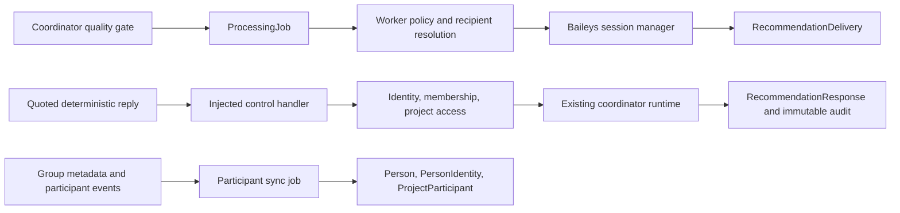

# WhatsApp-Native Operations

| Field        | Value                                                                                       |
| ------------ | ------------------------------------------------------------------------------------------- |
| Purpose      | Define FieldOS WhatsApp recommendation, identity, participant, invitation, and audit flows. |
| Owner        | Platform Engineering                                                                        |
| Status       | Implemented, Dark Launch                                                                    |
| Last Updated | 2026-07-24                                                                                  |

## Table of Contents

- [Current-System Discovery](#current-system-discovery)
- [Architecture](#architecture)
- [Recommendation Routing](#recommendation-routing)
- [Reply Protocol](#reply-protocol)
- [Authorization Model](#authorization-model)
- [High-Impact Confirmation](#high-impact-confirmation)
- [Identity Model](#identity-model)
- [Participant Synchronization](#participant-synchronization)
- [Invitation Flow](#invitation-flow)
- [JID and LID Handling](#jid-and-lid-handling)
- [Delivery Reliability](#delivery-reliability)
- [Audit Model](#audit-model)
- [Security Model](#security-model)
- [Failure Modes](#failure-modes)
- [Rollout Plan](#rollout-plan)
- [Official WhatsApp Business Migration](#official-whatsapp-business-migration)

## Current-System Discovery

The mandatory pre-implementation trace found these existing ownership boundaries:

- `packages/integrations/whatsapp/baileys` owns socket creation, reconnects, QR state, history discovery, JID/LID alias promotion, `messages.upsert`, media download, active-chat ingestion, and outbound draft sending. The returned Baileys message key is already persisted for drafts.
- Group metadata is currently read only to obtain a group title. Current participants are not synchronized and `group-participants.update` is not handled.
- `messages.upsert` currently sends every active-chat inbound message through normal message persistence, search indexing, evidence processing, and AI classification. There is no control-message interception point yet.
- `packages/messaging` remains channel-agnostic and owns generic conversations, participants, messages, attachments, validation, and authorization-aware services. WhatsApp-native control behavior must remain outside it.
- `packages/coordinators` owns recommendation creation, quality gating, approval, dismissal, completion, milestone side effects, Action Item creation, report generation, and WhatsApp draft creation. WhatsApp replies must call this runtime rather than reimplement its effects.
- `packages/db/src/background-processing.ts` and `apps/worker` provide the existing idempotent processing-job queue, bounded retries, worker heartbeat, throttling, and job visibility. Retryable delivery and participant synchronization belong there.
- `apps/api` owns authenticated membership, organization-role, and project-access enforcement. Recommendation endpoints already authorize before calling the coordinator runtime.
- `packages/auth` provides cookie-backed JWT sessions and password setup. It intentionally contains no provider-identity semantics.
- `apps/api/src/team-service.ts` owns secure, hashed, expiring email invitations and creates membership/project access only after authenticated acceptance. Email invitations remain unchanged.
- Existing `Event`, `ProductAnalyticsEvent`, and `UserNotification` records do not contain the actor identity, delivery correlation, command, and authorization outcome required for immutable WhatsApp security auditing.
- Existing notification state has no project WhatsApp delivery preferences, quiet hours, routing mode, recipient resolution, or daily limits.

These findings establish the implementation rule: extend Baileys through injected domain callbacks, reuse coordinator actions, reuse the processing queue, keep authorization in API/domain policy, and add explicit person/identity/delivery persistence rather than overloading chat participants or memberships.

## Architecture

Messaging stays channel-agnostic. Baileys owns provider transport and identifiers. The worker owns retryable delivery and reply processing. Coordinators remain the sole owner of recommendation side effects. The API owns authenticated administration and tenancy enforcement.

## Recommendation Routing

Project settings combine an environment kill switch with project opt-in. Routing supports private project managers, named approvers, the connected-account owner, an explicitly selected project group, or platform-only review. Allowed types, urgent-only mode, quiet hours, timezone, recipient/project daily limits, cooldowns, and high-impact confirmation are persisted. Private delivery is the default. Sensitive content is always blocked from group routing.

## Reply Protocol

Commands are case-insensitive but exact: `APPROVE`, `REJECT`, `DETAILS`, three bounded `SNOOZE` forms, `CONFIRM REC-*`, `CANCEL REC-*`, `REASON:`, and invitation `JOIN`. Natural language is never approval. Recommendation correlation uses the quoted Baileys outbound message key; the visible reference is supporting context only. Unquoted approval is intercepted and rejected as ambiguous, so it cannot enter classification or trigger an action.

## Authorization Model

A state-changing reply requires a confirmed identity, linked Person and FieldOS user, active organization membership, project access, correct addressed recipient, pending unexpired recommendation, and the configured group-approval policy where applicable. Group replies are limited to explicitly selected named approvers even when group approval is enabled. Named approvers still need platform access. WhatsApp group-admin status is metadata only and never grants FieldOS permission.

## High-Impact Confirmation

Actions are classified as low, standard, or high impact. Completing/starting/updating milestones and preparing external WhatsApp drafts are high impact. When configured, the first approval opens a 15-minute confirmation window. Only the same verified identity can send the matching `CONFIRM REC-*`; cancellation, expiry, mismatched references, and replay perform no side effect.

## Identity Model

`Person` is the organization-scoped contact. `PersonIdentity` is the account-scoped WhatsApp JID/LID identity. `ProjectParticipant` records involvement without authentication. `Membership` and `ProjectAccess` remain the only platform authorization records. A user can have a separate Person per organization. Identity reviews hold uncertain or conflicting matches.

## Participant Synchronization

Activating an active project group queues a metadata sync, and `group-participants.update` queues subsequent syncs. Exact account JID/LID matches are reused; only confirmed exact phone identities may match across provider identifiers. Display names never auto-merge. Removal marks group and project participation inactive while preserving people, messages, evidence, membership, and other access routes.

## Invitation Flow

Admins can invite a discovered contact through WhatsApp while email invitations remain unchanged. `JOIN` must quote the invitation and creates only a random, hashed, single-use activation token. It does not create membership. The recipient must sign in or create a password-backed account, confirm the invitation and terms, then the API atomically links identity, membership, and scoped project access.

## JID and LID Handling

JIDs and LIDs are stored independently and scoped to the connected account. Phone numbers are optional derived data, never the sole identity key. A JID/LID conflict marks the identity for review and cannot silently transfer authorization.

## Delivery Reliability

Delivery has an idempotency key of recommendation plus recipient. The persisted Baileys key correlates replies. Jobs retry with bounded exponential backoff, temporal controls defer safely, and failed records remain visible. A global outbound throttle protects the session. Baileys read/delivery receipts are not fabricated; `SENT` means the socket returned a message key.

## Audit Model

`RecommendationResponse` prevents duplicate inbound processing. `WhatsAppOperationAudit` records safe event type, actor links, delivery/recommendation IDs, provider message IDs, command, authorization outcome, and reason code. It excludes full private message bodies, credentials, prompts, and chain-of-thought.

## Security Model

The design denies unverified, forwarded, unquoted, replayed, expired, superseded, cross-project, and mismatched-identity actions. Group approval is off by default and independently authorizes the sender. Discovery never creates a user. Activation tokens are hashed, expiring, scoped, and consumed once. Every outbound capability has an environment kill switch.

## Failure Modes

- Disconnected account: delivery retries and remains failed/observable after bounded attempts.
- Metadata unavailable: participant sync retries without deleting existing people.
- Ambiguous identity: a review item is created and authorization remains denied.
- Missing recipient: the recommendation remains available in FieldOS.
- Quiet hours or limits: work is deferred; urgent policy can bypass quiet hours.
- Baileys identifier changes: no authorization transfer without deterministic resolution.

## Rollout Plan

All environment kill switches default to disabled. Initial Railway deployments apply additive migrations and verify existing behavior without sending recommendations, synchronizing group participants, or delivering WhatsApp invitations. Enable participant sync first for one non-production group, then private delivery/replies for one demo project, then invitations. Group routing remains last and opt-in. Roll back instantly by setting all four flags false; platform review remains available.

## Official WhatsApp Business Migration

The domain models use provider-neutral people and project participation plus provider-specific identities and deliveries. A future official Meta Cloud API adapter can preserve authorization, recommendation, invitation, and audit semantics while replacing Baileys socket and receipt handling.
